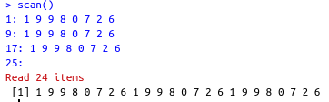
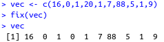

```{r setup, include=FALSE}
knitr::opts_chunk$set(echo = TRUE)
```

## Estructura de datos

Un vector es una secuencia ordenada de datos, ```R``` dispone de muchos tipos de datos, por ejemplo

* ```logical```: lógicos (```True``` o ```FALSE```)
* ```integer```: números enteros, $\mathbb{Z}$
* ```numeric```: números reales, $\mathbb{R}$
* ```complex```: números complejos, $\mathbb{C}$
* ```character```: palabras

En los vectores de R, todos sus objetos han de ser del mismo tipo: todos números, todos palabras, etc. Cuando queramos usar vectores formados por objetos de diferentes tipos, tendremos que usar listas generalizadas, ```lists```

## Básico

* ```c()```: para definir un vector
* ```scan()```: para definir un vector
* ```fix(x)```: para modificar visualmente el vector x
* ```rep(a,n)```: para definir un vector constante que contiene el dato $a$ repetido $n$ veces

```{r ejemplo1}
c(1,2,3)
rep("Mates", 5)
rep(c(1,2,3),3)
```

### Ejemplo

Vamos a crear un vector que contenga 3 copias de 1 9 9 8 0 7 2 6 con la función scan:



### Ejercicio
1. Repite tu año de nacimiento 10 veces
2. Crea el vector que tenga como entradas 16, 0, 1, 20, 1, 7, 88, 5, 1, 9, llámalo vec y modifica la cuarta entrada con la función fix()

1.-
```{r ejercicio1}
rep("02/06/02",10)
```

2.-




## Progresiones y Secuencias
Una progresión aritmética es una sucesión de números tales que la diferencia, $d$, de cualquier par de términos sucesivos de la secuencia es constante.

$$a_n = a_1 + (n-1) \cdot d$$

* ```seq(a,b,by=d)```: para generar una progresión aritmética de diferencia $d$ que empieza en $a$ hasta llegar a $b$

* ```seq(a,b, length.out=n)```: define progresión aritmética de longitud $n$ que va de $a$ a $b$ con diferencia $d$. Por tanto $d = (b-a)/(n-1)$

* ```seq(a,by=d, length.out=n)```: define la progresión aritmética de longitud $n$ y diferencia $d$ que empieza en $a$

* ```a:b```: define la secuencia de números enteros $(\mathbb{Z})$ consecutivos entre dos números $a$ y $b$

### Ejemplo

```{r ejemplo2}
# Progresión creciente
seq(5,60, by=3.5)

# Progresión decreciente
seq(20, -4, by = -2)

seq(4,25, length.out = 8)

seq(4,length.out = 6, by = 6)

1:10

23:-10

-1:3

-(2:5)
```


### Ejercicio

* Imprime los números del 1 al 20
* Imprime los 20 primeros números pares
* Imprime 30 números equidistantes entre el 17 y el 98, mostrando solo 4 cifras significativas

```{r ejercicio2}
#1.-
1:20

#2.-
seq(2, length.out = 20, by = 2)

#3.-
round(seq(17,98, length.out = 30), digits = 4)
```


## Funciones
Cuando queremos aplicar una función a cada uno de los elementos de un vector de datos, la función ```sapply``` nos ahorra tener que programar con bucles en ```R```:

* ```sapply(nombre_de_vector, FUN=nombre_de_funcion)```: para aplicar dicha función a todos los elementos del vector

* ```sqrt(x)```: calcula un nuevo vector con las raíces cuadradas de cada uno de los elementos del vector $x$


Existen algunas operaciones que se pueden realizar a un vector

```{r ejemplo3}
x = 1:10
x + pi
pi*x
sqrt(x)
2^x
x^2
```

Para hacer uso de la función *sapply*

```{r sapply}
sapply(x, function(elemento){sqrt(elemento)})

cd = function(x){x^pi}
sapply(x, FUN = cd)
```

Otros ejemplos de operaciones de vectores

Suma de vectores
```{r sumVec}
1:10 + 1:10
(1:10) * (1:10)
(1:10)^(1:10)
```


### Funciones para vectores

Dado un vector de datos $x$ podemos calcular muchas medidas estadísticas acerca del mismo:

* **lenght()**: calcula la longitud del vector $x$
* **max(x)**: calcula el máximo del vector $x$
* **min(x)**: calcula el mínimo del vector $x$
* **sum(x)**: calcula la suma de las entradas del vector $x$
* **prod(x)**: calcula el producto de las entradas del vector $x$
* **mean(x)**: calcula la media aritmética de las entradas del vector $x$
* **diff(x)**: calcula el vector formado por las diferencias sucesivas entre entradas del vector original $x$
* **cumsum(x)**: calcula el vector formado por las sumas acumuladas de las entradas del vector original $x$
    * Permite definir sucesiones descritas mediante sumatorios
    * Cada entrada de **cumsum(x)** es la suma de las entradas de $x$ hasta su posición
    
```{r ejemFunc}
x = c(1,2,3,4,5,6)
mean(x)
cumsum(x)
```

### Orden

* **sort(x)**: ordena el vector en orden natural de los objetos que lo forman: orden numérico creciente, orden alfabético...

* **rev(x)**: invierte el orden de los elementos del vector $x$

```{r orden}
v = c(1,7,5,2,4,6,3)
sort(v)
rev(v)
```

### Ejercicio

* Combinar dos funciones anteriores **sort** y **rev** para crear una función que dado un vector $x$ nos lo devuelva ordenado en orden descendiente

* Razonar si aplicar primero **sort** y luego **rev** a un vector $x$ daría en general el mismo resultado que aplicar primero **rev** y luego **sort**

* Investigar la documentación de la función **sort** para leer si cambiando algún argumento de la misma se puede obtener el mismo resultado que haber programado en el primer ejercicio

```{r ejercicio3}
# 1.-
newSort = function(x){rev(sort(x))}
y = c(1,93,4,-6,29,3,-12)
newSort(y)

# 2.-
rev(sort(y))
sort(rev(y))

#3.- 
#Se puede hacer el mismo efecto del primer ejercicio, haciendo uso del argumento decreasing = TRUE
```


## Subvectores

* **vector[i]**: de la i-ésima entrada del vector

* **vector[length(vector)]**: nos da la última entrada del vector

* **vector[a:b]**: si $a$ y $b$ son dos números naturales, nos da el subvector con las entradas del vector original tal que van de la posición $a$-ésima hasta la $b$-ésima

* **vector[-i]**: si $i$ es un número, este subvector está formado por todas las entradas del vector original menos la entrada $i$-ésima. Si $i$ resulta ser un vector, entonces es un vector de índices y crea un nuevo vector con las entradas del vector original cuyos índices pertenecen a $i$

* **vector[-x]**: si $x$ es un vector (de índices), entonces este es el complementario de vector[$x$]

También podemos utilizar operadores lógicos

* **==**: =
* **!=**: $\neq$
* **>=**: $\geq$
* **<=**: $\leq$
* **<**: <
* **>**: >
* **!**: NO lógico
* **&**: Y lógico
* **|**: O lógico

### Ejemplo
```{r subvectores}
v = c(12,3,5,25,6,3,46)
v[2]
v[-c(3,5)]
v[v != 19 & v>15]

#obtener números pares
v[v%%2 == 0]

x = seq(3,24, by=2.4)
x
#penúltimo elemento
x[length(x)-1]
#subvector de x
x[3:7]
#subvector de x de reversa
x[7:3]

# obtener subvector de posiciones par
x[seq(2,length(x), by=2)]

```


## Condicionales

* **which(x cumple condicion)**: para obtener los índices de las entradas del vector $x$ que satisfacen la condición dada.

* **which.min(x)**: nos da la primera posición en la que el vector $x$ toma su valor mínimo

* **which(x==min(x))**: da todas las posiciones en las que el vector $x$ toma sus valores mínimos

* **which.max(x)**: nos da la primera posición en la que el vector $x$ toma su valor máximo

* **which(x==max(x))**: da todas las posiciones en las que el vector $x$ toma sus valores máximos


```{r which}
z = c(32,2,6,12,8,7,7,1,9)
z[z>5]
z[which(z>5)]
which(z > 2 & z < 9)
z[which(z>2 & z<6)]
```


## Los valores NA

Significa "Not available"

Se puede dar de la siguiente manera

```{r na}
z = c(32,2,6,12,8,7,7,1,9)
z[length(z)+5] = 4
z
```


Si se hacen las funciones conocidas nos da como resultado NA

```{r sumNa}
sum(z)
prod(z)
```

Sin embargo, estas funciones cuentan con el argumento **na.rm = TRUE**, el cual elimina los NA de un vector

```{r }
sum(z, na.rm = TRUE)
prod(z, na.rm = TRUE)
```

Para conocer que elemenots son NA o no se puede hacer uso de la función **is.na()**

```{r}
is.na(z)
```


Para poder reemplazar dichos valores dentro del vector, se usa la media aritmética obtenida

```{r isna}
z[is.na(z)] = mean(z, na.rm = TRUE)
z
```


Para poder hacer uso de funciones como **cumsum()**, en donde el argumento **na.rm** no existe, podemos hacer lo siguiente

```{r cumsumNA}
z = c(32,2,6,12,8,7,7,1,9)
z[length(z)+5] = 4
cumsum(z[!is.na(z)])
```


